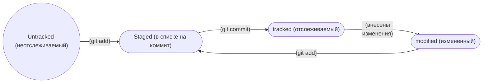

# Описание проекта **'Как создать репозиторий в Git'**
## Инструкция:
1) Научиться пользоваться терминалом:  
- Перемещаться по директориям;  
- Создавать файлы;  
- Удалять файлы;  

2) Создать папку для репозитория во внутреннем хранилище данных;  

3) Зайти в эту папку и инициализировать ее как главную ветку с помощью команды:
```
git init
``` 

3) Создать файл, который мы далее сохраним в репозитории;  

3) Добавляем новый (или обновленный) файл в ветку:
```
git add [имя файла/--all (для добавления всех файлов)]
```

3) Соединяем нашу ветку с главной веткой, обновляя историю локального хранилища:
```
git commit
```
*Также можно добавить сообщение к обновлению, чтобы было понятно, что изменилось.* Добавим следующий кусок кода:
```
-m '[сообщение, которое хотим оставить]'
```
**Файл готов, чтобы синхронизировать репозитории.**

4) Создать удаленный репозиторий на платформе GitHub;  

5) Скопировать ssh ключ удаленного репозитория;  

6) Использовать в терминале команду: 
```
git remote add [имя новой глав. ветки] [ssh удаленного репозитория]
```
  
7) Проверить соединение репозиториев с помощью команды:
```
git remote -v
```
Должно повиться сообщение:
```
[имя ветки] [ssh удаленного репозитория] (fetch)
[имя ветки] [ssh удаленного репозитория] (push)
```
8) Принудительно соединить репозитории с помощью команды:
```
git push -u [имя ветки] [master/main]
```
Далее можно будет использовать сокращенную форму команды для отправки файлов на сервер:
```
git push
```

## Дополнительная информация по работе с Git.
1) **Хэш** - уникальный номер коммита.  

Хэш - это закодированное содержание закоммиченного файла. Соответственно, если изменить хотя бы один символ в этом файле, то получится совершенно другой хэш. Также если закодировать тот же самый файл на другом компьютере, то получится точно такой же хэш, как и на первом компьютере.  

2) **Лог** - история коммитов, которую можно вывести с помощью команды через терминал или посмотреть на GitHub.  

Лог содержит все коммиты для главной ветки, отсортировав их от самого актуального до самого первого. В каждом коммите указан его уникальный хэш и комментарий, оставленный разработчиком, который добавил этот коммит.  

*Команда для терминала:*
```
git log
```

3) **HEAD** - это самый актуальный коммит, присоединенный к главной ветка. Подписывается в истории коммитов.  

4) Также можно вывести статус файлов, находящихся в папке репозитория. **Типы статусов:**  

- *untracked* - неотслеживаемый файл, который ранее не был загружен в репозиторий. Git не может следить за изменениями в нем.   
- *staged* - файл, который находится в staging area - в список файлов, который войдут в коммит.  
- *tracked* - противоположность статуса *untracked*. Это файл, который отслеживается Git.  
- *modified* - измененный файл. Статус означает, что Git сравнил содержимое файла с последней сохранённой версией и нашёл отличия.  

**Путь статусов:**  


	