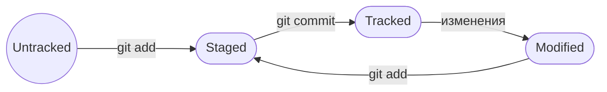

# Дополнительная информация по работе с Git

## Терминология

**Хэш** - уникальный номер коммита.  

Хэш - это закодированное содержание файла после последнего коммита. Соответственно, если изменить хотя бы один символ в этом файле, то получится совершенно другой хэш. Также если закодировать тот же самый файл на другом компьютере, то получится точно такой же хэш, как и на первом компьютере.  

**Лог** - история коммитов, которую можно вывести с помощью команды через терминал или посмотреть на GitHub.  

Лог содержит все коммиты для главной ветки, отсортировав их от самого актуального до самого первого. В каждом коммите указан его уникальный хэш и комментарий, оставленный разработчиком, который добавил этот коммит.  

*Команда для терминала:*
```
git log
```
> [!TIP]
> Чтобы вывести краткую версию лога только с укороченным хешем и сообщением коммита, нужно добавить после команды атрибут `--oneline` (One Line - одна линия).

**HEAD** - это самый актуальный коммит, присоединенный к главной ветка. Подписывается в истории коммитов.  

Также можно вывести статус файлов, находящихся в папке репозитория.  

**Типы статусов:**  

- *untracked* - неотслеживаемый файл, который ранее не был загружен в репозиторий. Git не может следить за изменениями в нем.   

- *staged* - файл, который находится в staging area - в список файлов, который войдут в коммит.  

- *tracked* - противоположность статуса *untracked*. Это файл, который отслеживается Git.  

- *modified* - измененный файл. Статус означает, что Git сравнил содержимое файла с последней сохранённой версией и нашёл отличия.  

**Путь статусов:**  



## Необходимые функции для работы

1. **Исправление последнего коммита** выполняется с помощью команды `git commit --amend`.  

Чтобы исправить коммит, нужно добавить исправленный файл в список с помощью `git add`, а затем применить функцию выше. Тогда изменения добавятся в последний коммит.  

Но к команде обязательно нужно добавить еще опции в конце в зависимости от того, что мы хотим:  

- `--no-edit`, если нам не нужно менять сообщение изменяемого коммита;  
- `-m '[новое сообщение]'`, если нам нужно изменить сообщение. В таком случае изменится хэш коммита;  

> [!WARNING]
> С помощью этой команды можно изменить только последний коммит. То есть тот, который в **head**.  


2. **Удаление файла из staging area.**  

Если вдруг вы добавили файл в лист ожидания на коммит, хотя добавлять его не хотели, используетс команда `git restore --staged [имя файла]`.  

Если вы изменили файл, который не нужно было изменять, но в *staging area* вы его еще не добавили (файл находится в статусе *modified*), то можно его откатить к последней сохраненной версии с помощью этой же команды, но без опции `--staged`:  

```
git restore [имя файла]  
```

Также если вы хотите откатить не один файл, а всю папку, то вместо имени файла используется символ `.`  


3. Есть команда и для ситуации, когда ошибки найдены слишком поздно, и файл уже давно отправлен на основную ветку. В этом случае нужно **откатить обновления на один или даже несколько коммитов назад**.  

Следующая команда возвращает проект на состояние коммита, который указан в команде:

```
git reset --hard [хэш коммита]
```

Будьте аккуратны с этой командой, потому что при откате к предыдущим коммитам все данные "из будущего" стираются.  


4. **Сравниваем изменения в файлах.**  

Для этого есть команда:
```
$ git diff
```
Однако по умолчанию она показывает различия между сохраненной версией и той, которая находится в статусе *modified* (то есть еще не добавлен в *staging area*). 
Если файл уже добавлен, то к команде добавляется флаг `--staged`.

Чтобы сравнить два различных коммита файла используется команда:
```
git diff <коммит1> <коммит2>
```
Причем *коммит1* - более старый, а *коммит2* - более новый. Тогда логика добавленных строк не нарушится. Если поменять коммиты местами, то изменения будут как будто реверсивными. 

> [!TIP]
> Также можно вместо хеша коммита использовать имя **HEAD**, если вы хотите сравнить какой-то коммит с самым актуальным.
